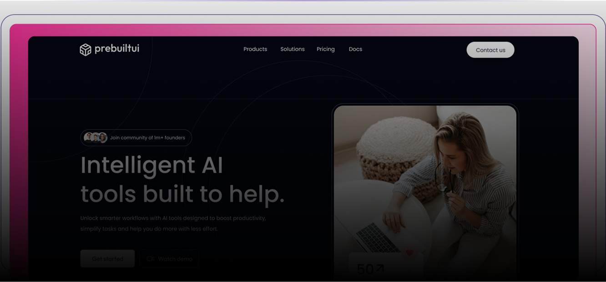

# Thumblify 🎨

A full-stack AI-powered YouTube thumbnail generator built with React, Node.js, and multiple AI APIs.



---

## 🚀 Features

- 🤖 AI-powered thumbnail generation using Groq (Llama) + Hugging Face (FLUX.1-dev)
- 🎨 Multiple styles: Bold & Graphic, Tech/Futuristic, Minimalist, Photorealistic, Illustrated
- 🌈 8 color schemes: Vibrant, Sunset, Forest, Neon, Purple, Monochrome, Ocean, Pastel
- 📐 Aspect ratio support: 16:9, 9:16, 1:1
- 📝 Automatic text overlay on generated thumbnails via Cloudinary
- 🔐 User authentication with sessions
- ☁️ Cloud image storage with Cloudinary
- 🗄️ MongoDB database for storing generations
- 👁️ YouTube preview mode to see how thumbnails look on YouTube
- 📥 Download generated thumbnails

---

## 🛠️ Tech Stack

### Frontend
- React 19 + TypeScript
- Tailwind CSS v4
- React Router DOM v7
- Axios
- Framer Motion
- Lenis (smooth scroll)
- Lucide React (icons)

### Backend
- Node.js + Express v5
- TypeScript + TSX
- MongoDB + Mongoose
- Express Session + connect-mongo
- Groq SDK (Llama 3.3 70B)
- Hugging Face Inference (FLUX.1-dev)
- Cloudinary (image storage + text overlay)
- Bcrypt (password hashing)

---

## 📁 Project Structure

```
Thumblify/
├── client/                  # React frontend
│   ├── public/
│   ├── src/
│   │   ├── components/      # Reusable UI components
│   │   ├── pages/           # Page components
│   │   ├── sections/        # Landing page sections
│   │   ├── context/         # Auth context
│   │   ├── configs/         # API config
│   │   └── data/            # Static data
│   └── package.json
│
└── server/                  # Express backend
    ├── configs/             # DB, AI, Cloudinary config
    ├── controllers/         # Route controllers
    ├── middlewares/         # Auth middleware
    ├── models/              # Mongoose models
    ├── routes/              # Express routes
    └── server.ts            # Entry point
```

---

## ⚙️ Prerequisites

Make sure you have the following installed:

- [Node.js](https://nodejs.org/) v18 or above
- [MongoDB Atlas](https://www.mongodb.com/cloud/atlas) account (free tier)
- [Groq](https://console.groq.com) account (free)
- [Hugging Face](https://huggingface.co) account (free)
- [Cloudinary](https://cloudinary.com) account (free)

---

## 🔧 Installation & Setup

### 1. Clone the repository

```bash
git clone https://github.com/your-username/thumblify.git
cd thumblify
```

### 2. Setup the Server

```bash
cd server
npm install
```

Create a `.env` file inside the `server` folder:

```env
MONGODB_URI=your_mongodb_connection_string

SESSION_SECRET=your_session_secret

GROQ_API_KEY=your_groq_api_key

CLOUDINARY_CLOUD_NAME=your_cloudinary_cloud_name
CLOUDINARY_API_KEY=your_cloudinary_api_key
CLOUDINARY_API_SECRET=your_cloudinary_api_secret

HUGGINGFACE_API_KEY=your_huggingface_api_key
```

Start the server:

```bash
npm run server
```

Server runs at `http://localhost:3000`

### 3. Setup the Client

```bash
cd ../client
npm install
```

Create a `.env` file inside the `client` folder:

```env
VITE_API_URL=http://localhost:3000
```

Start the client:

```bash
npm run dev
```

Client runs at `http://localhost:5173`

---

## 🔑 Getting API Keys

### Groq API Key (Free)
1. Go to [console.groq.com](https://console.groq.com)
2. Sign up with Google
3. Click **API Keys** → **Create API Key**
4. Copy the key starting with `gsk_...`

### Hugging Face API Key (Free)
1. Go to [huggingface.co](https://huggingface.co)
2. Sign up and go to **Settings** → **Access Tokens**
3. Click **New Token** → Select **Read**
4. Copy the key starting with `hf_...`

### Cloudinary (Free)
1. Go to [cloudinary.com](https://cloudinary.com)
2. Sign up and go to **Dashboard**
3. Copy your **Cloud Name**, **API Key**, and **API Secret**

### MongoDB Atlas (Free)
1. Go to [mongodb.com/cloud/atlas](https://www.mongodb.com/cloud/atlas)
2. Create a free cluster
3. Go to **Database Access** → create a user
4. Go to **Network Access** → allow all IPs (`0.0.0.0/0`)
5. Click **Connect** → **Drivers** → copy the connection string

---

## 🧠 How It Works

```
User inputs title + style + color scheme
        ↓
  Groq AI (Llama 3.3 70B)
  Enhances the prompt into a detailed image generation description
        ↓
  Hugging Face (FLUX.1-dev)
  Generates the actual thumbnail image from the enhanced prompt
        ↓
  Cloudinary
  Uploads the image and adds bold text overlay (title) on the thumbnail
        ↓
  MongoDB
  Saves the thumbnail URL and metadata
        ↓
  Final thumbnail returned to user ✅
```


## 📜 Scripts

### Server
| Command | Description |
|---|---|
| `npm run server` | Start server with nodemon (development) |
| `npm start` | Start server without nodemon |
| `npm run build` | Compile TypeScript |

### Client
| Command | Description |
|---|---|
| `npm run dev` | Start development server |
| `npm run build` | Build for production |
| `npm run preview` | Preview production build |

---

## 🌐 Deployment

### Deploy Server (Vercel)
```bash
cd server
vercel
```

### Deploy Client (Vercel)
```bash
cd client
vercel
```

